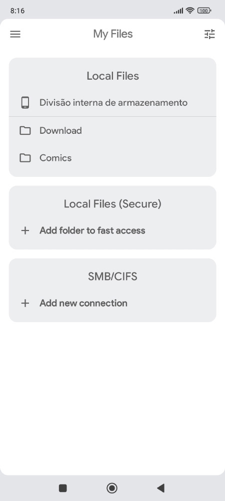

# Kuro Reader+
### Free comic reader for android.

## Download

For most devices, it is recommended to install the **arm64-v8a** version of the apk

- Download the latest stable version from [GitHub releases](https://github.com/VandersonQk/KuroReaderReleases/releases/latest)
- If you purchased the Pro version from the Play Store, you can access the [Activation Key Manager](https://kurotoshiro.dev/license_manager/) to create an activation key ([Video demonstration](https://www.youtube.com/watch?v=KsDLM-k7Q2E))
- If the **arm64-v8a** version doesn't install on your device, use the **universal** apk
- For emulators and x86/x86_64 devices install the **universal** apk
- Access the [FAQ](faq.md) for more information on key activation

## Screenshots

 

## Overview

#### ✔️ Organize everything in your library
Create your own library, with quick access to all your books. Include as many folders as you want, and see all your comics and manga sorted by author, series and year.

#### ✔️ Customizable and modern
A modern interface with multiple customization options that allow you to personalize it to your liking

#### ✔️ Direct access to your files
Read your comics and manga directly from your device storage or your SMB network

#### ✔️ Supports the most popular comic formats
You can read all major comic formats:  CBZ, CBR, CBT and CB7.Including support for standard archive formats: zip, rar, tar, 7z

#### ✔️ Detailed information about your comics
In addition to the basic file information, you can also access the advanced details of your comics, if available: all ComicRack metadata is supported by the app.

#### ✔️ No ads
You don't need to buy the pro version just because of annoying ads

#### ✔️Reader features

* Custom collections
* Comic tagging
* Fingerprint and screenshot lock
* Bookmarks and favorites
* Manga mode, with right-to-left reading
* Webtoon mode, with vertical strip reading
* Support for ComicRack bookmarks (used as table of contents)
* Table of contents automatically generated for some comics (analyzing the file name)
* Preview of all pages
* Undo and redo actions

#### 💲Pro/Paid features
* Dark themes
* 7 extra themes, including dark and amoled variants
* Save images from the comics in your files in one-touch
* Basic comic metadata edition
* Support for PDF files
* You'll be supporting the app development, encouraging the developer

## Translate Kuro Reader

Join our open translation project for Kuro Reader at [Crowdin](https://crowdin.com/project/kuroreader).

## Legal

* ComicRack for Windows is a trademark of cYo Soft, All Rights Reserved
* The comics used in the screenshots are public domain and free to use
* **This app is just a reader, and doesn't include any files**

